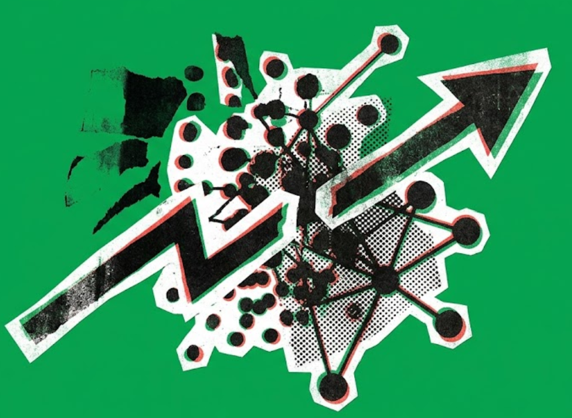
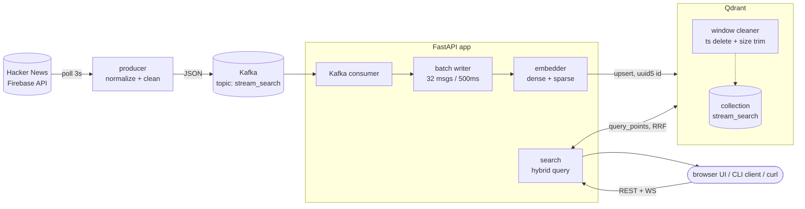
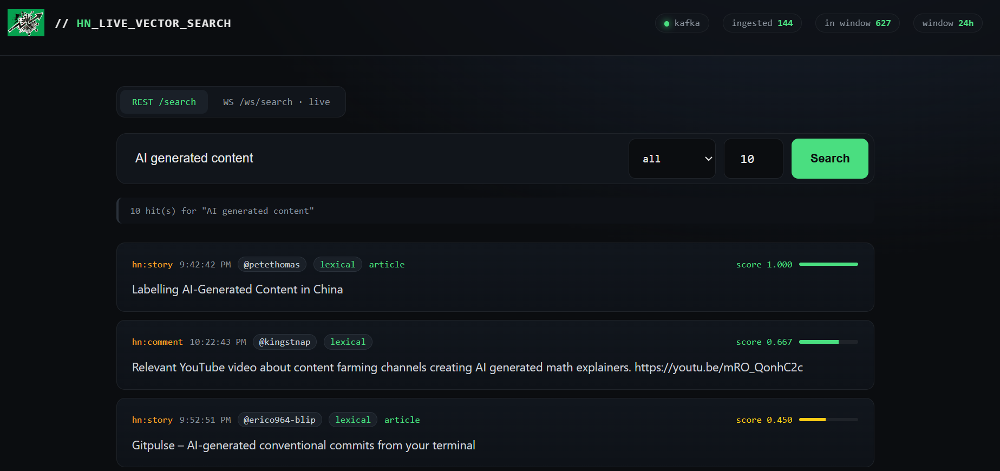

<div align="center">


<h1>Real-Time Qdrant Search</h1>

<p>
  <a href="LICENSE"></a>
  <a href="https://github.com/qdrant/qdrant"></a>
  <a href="https://github.com/Goodnight77/Realtime-search-kafka-Qdrant/stargazers"></a>
  <a href="https://discord.gg/qdrant"></a>
</p>

<p>
    A live Hacker News firehose, turned into instant hybrid vector search. Qdrant is doing all the hard work.
</p>

</div>

---

Every comment, story, and poll on HN lands in this project within seconds, gets embedded twice (dense + sparse), and becomes searchable immediately ranked by Qdrant's own RRF fusion, filtered by Qdrant's own payload index, evicted by Qdrant's own delete API. There's no separate search engine, no separate cache, no separate ranking layer bolted on top. Kafka just moves bytes; FastAPI just shuttles HTTP. **Qdrant is the database, the ranker, the filter, and the retention policy the entire intelligence of this app lives in one Qdrant collection.**

- Real source: **Hacker News Firebase** (`maxitem.json` polled every 3s, new items fetched, pushed to Kafka)
- Bus: **Kafka** (KRaft single-node via Docker) pure transport, zero logic
- Brain: **Qdrant hybrid retrieval** dense `BAAI/bge-small-en-v1.5` + sparse `Qdrant/bm25`, fused server-side with RRF in a single `query_points` call
- Store: **Qdrant Cloud** by default, or self-host the identical engine locally with one flag same API either way
- API: FastAPI (`/search`, `/health`, `/ws/search`, `/docs`)

## Why Qdrant is the centerpiece, not a detail

Most "vector search demo" repos use a vector store as a dumb sink embed once, upsert once, never touch it again. This one leans on Qdrant for things a lot of stacks bolt on extra infrastructure for:

- **Hybrid search in one round trip.** Dense semantic + sparse lexical (BM25) vectors live as two **named vectors** on the same point. One `query_points` call with two `Prefetch` branches and `Fusion.RRF` does the fusion *inside Qdrant* no separate reranking service, no manual score blending in app code.
- **Real-time upserts, not batch reindexing.** Every Kafka batch (32 msgs / 500ms) is embedded and `upsert`ed straight into the live collection. Qdrant serves consistent reads against a collection that's being written to multiple times a second.
- **Self-cleaning by design.** A background loop calls Qdrant's `delete` with a `ts` range filter every 5 seconds, plus a `scroll` + `delete` sweep to cap collection size Qdrant enforces the "latest N hours / latest N points" window natively, no cron job, no TTL daemon, no separate cleanup service.
- **Idempotent ingestion.** Point IDs are deterministic (`uuid5` of `source:hn_id`), so Qdrant's `upsert` doubles as natural dedup replay the same message twice, get one point, not two.
- **Payload filtering at query time.** Source-type filters (`hn:story`, `hn:comment`, …) and the time-window cutoff both ride along as Qdrant `Filter` conditions on the *same* hybrid query no post-filtering in Python.
- **Cloud or local, same engine, same code.** Point `QDRANT_URL` at Qdrant Cloud (default) or spin up the exact same Qdrant image locally with a Compose profile zero application code changes either way.

## Architecture



## Setup (uv)

```bash
uv venv
.venv\Scripts\activate          # Windows
# source .venv/bin/activate     # macOS/Linux
uv pip install -r requirements.txt
```

**Default path is Qdrant Cloud** the only external service this project truly depends on:

1. Sign up at [cloud.qdrant.io](https://cloud.qdrant.io) and create a free cluster.
2. On that cluster's dashboard, copy its **endpoint URL** and generate an **API key**.
3. Copy `.env.example` → `.env`, paste those into `QDRANT_URL` and `QDRANT_API_KEY`.

That's it nothing else to provision. Embeddings run locally via `fastembed`, so no embedding API key is needed. (Want local Qdrant instead? See [Want to self-host Qdrant instead of Cloud?](#want-to-self-host-qdrant-instead-of-cloud) below.)

Hybrid search uses named vectors (`dense`, `sparse`). On startup, the API recreates `COLLECTION_NAME` if the existing collection schema doesn't match the hybrid dense+sparse schema.

## Run local dev (3 terminals + Kafka container)

Start Kafka only (Qdrant is cloud):
```bash
docker compose up -d kafka
```

Terminal 1 API (consumes Kafka, exposes search):
```bash
uvicorn app.api:app --host 0.0.0.0 --port 8000
```

Terminal 2 real-data producer:
```bash
python hn_producer.py
```

Terminal 3 live search subscription:
```bash
python client_demo.py "rust programming"
```

REST search:
```bash
curl -X POST http://localhost:8000/search -H "Content-Type: application/json" -d "{\"query\":\"AI startups\",\"k\":5}"
```

Filtered hybrid search:
```bash
curl -X POST http://localhost:8000/search -H "Content-Type: application/json" -d "{\"query\":\"kafka\",\"k\":10,\"source\":\"hn:comment\"}"
```

Health:
```bash
curl http://localhost:8000/health
```

OpenAPI: http://localhost:8000/docs

## Run full stack in Docker

```bash
docker compose up --build
```
Brings up Kafka + API + hn_producer. **Qdrant Cloud is the default** nothing else to run, no local vector database container at all.

### Want to self-host Qdrant instead of Cloud?

There is no auto-switch the app always connects to whatever `QDRANT_URL` says in `.env`. Two separate steps, both required:

1. **Start the local container:**
   ```bash
   docker compose --profile local-qdrant up --build
   ```
   This additionally starts a local `qdrant/qdrant` container on `6333`/`6334`. Without `--profile local-qdrant`, that container never starts at all, regardless of what `QDRANT_URL` says.

2. **Point `.env` at it:** set `QDRANT_URL=http://qdrant:6333` (from inside Docker) or `QDRANT_URL=http://localhost:6333` (running the API outside Docker). Until you change this, the app keeps talking to Cloud even if the local container is running right next to it.

Same code either way hybrid query, payload filters, window eviction work identically against both deployments. Just remember step 2 isn't automatic.

## Try the UI

Once the API is up, open **http://localhost:8000/** a live REST/WebSocket search console with a real-time `kafka`/`ingested` health pill. Must be loaded from the server (not opened as a local file), since it polls `/health` and `/search` over relative paths.



## Window semantics

- `WINDOW_SECONDS` (default 86400) points older than 24 hours are deleted by `ts` filter delete.
- `WINDOW_SIZE` (default 10000) if total > N, oldest trimmed by `ts ASC` scroll.
- Search filters `ts >= now - WINDOW_SECONDS` so stale points never returned even before sweep.

## HN message shape

Producer emits:
```json
{"text": "...", "source": "hn:story|comment|ask|job|poll", "ts": <epoch>, "id": <hn_id>}
```
